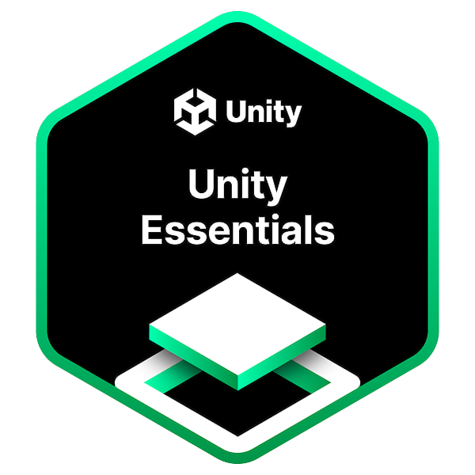
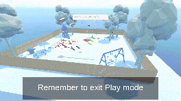

# 🎮 Unity Essentials Project

This is my **Unity Essentials Project**, built while completing the [Unity Essentials Pathway](https://learn.unity.com/pathway/unity-essentials).  
It demonstrates the fundamentals of Unity game development — including scenes, game objects, components, physics, UI, and simple interactions.

👉 **Play the Game Here:**  
[My Unity Essentials Project](https://play.unity.com/en/games/e208e8b9-a11f-42c1-931c-be41abeea700/my-unityessentialsproject)

---

## 📸 Badge & 🎥 Gameplay

<p float="left">
  
  
</p>

---

## 🕹️ How to Play
- Use **Arrow Keys** or **WASD** to move.
- Use **Esc** Key to exit scenes
- Use Mouse to move camera
- Interact with objects to explore the scene.  
- Complete the mini goals to progress. 

---

## ⚙️ Tech Stack
- **Engine:** Unity  
- **Language:** C#  
- **Platform:** WebGL (playable in browser)  

---

## 🚀 Running Locally
If you want to run this project locally:  
1. Clone the repo:  
   ```
   git clone https://github.com/tauhaimran/UnityEssentials.git
   ```

2. Open the project in Unity Hub (**Unity 2021 or later** recommended).
3. Press **Play** in the editor, or build to your platform of choice.

---

## 📂 Repository Structure

```
UnityEssentials/
│── Assets/          # Game assets (scripts, scenes, prefabs, etc.)
│── Packages/        # Unity package dependencies
│── ProjectSettings/ # Unity project settings
│── README.md
```

---

## 📜 License

This project is for educational purposes as part of Unity Learn.
Feel free to fork and experiment with it!

---

## ✨ Acknowledgments

* [Unity Learn](https://learn.unity.com/) for the training pathway.
* My progress and practice while exploring Unity game dev basics.

---

## 🔢 Secret Code for Scene 1

The first scene is locked behind a **4-digit code**.  
Solve this quick riddle to reveal it:

(2² × 500) + 4


What do you get? 👀  

